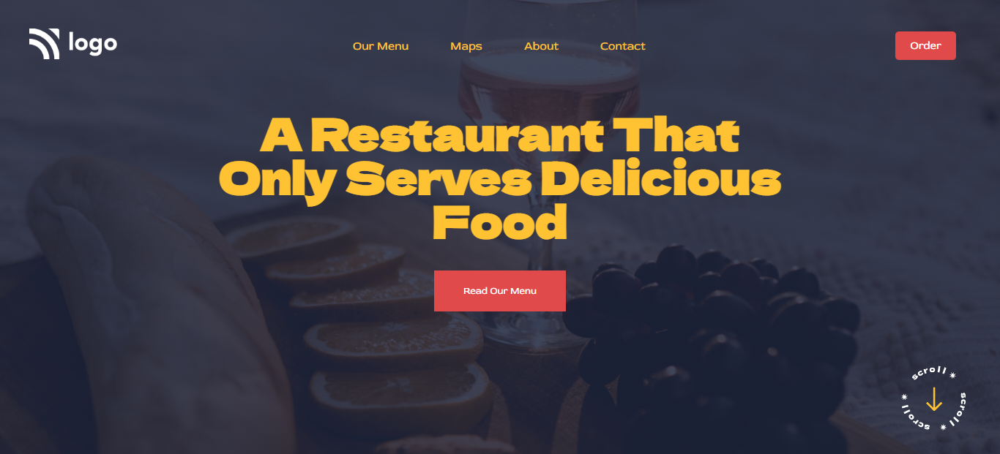

# Food Restaurant Home Page

-green)

***
## Description

This project [Food Restaurant Home Page]() was built using Semantic HTML and CSS. The main aim of the project was to use more **flexbox** and its properties.In this project I also learnt how to use **linear gradient** on background image. The Project was completed under guidance of [Hitesh Choudhary](https://github.com/hiteshchoudhary), CTO Ineuron

***

### Links for Project

* [LIVE Project Link]()

* [Youtube Video Demo]()

* [Source Code]()

***
### Built With 

* Semantic HTML
* Custom CSS classes
* FlexBox
* Linear Gradient

***

### Key Learnings

* Learned using [flexbox](https://developer.mozilla.org/en-US/docs/Web/CSS/flex)
* Learned to use [linear-gradient](https://developer.mozilla.org/en-US/docs/Web/CSS/gradient/linear-gradient)
* Learned to use image as cover in the background

***

### Time Taken to finish this project
 

>2 hours

 

***

### Screencapture of Project

 

***
 

### Checkout Portfolio & Other Projects
 

#### [Personal Portfolio]()

#### [Findcoder Profile]()
***

### Connect with Me
* [Mailto](mailto:shubhambhoj3@gmail.com)
* [LinkedIn]()
* [Github]()
* [Findcoder]()
***
***
[go to top](#food-restaurant-home-page)